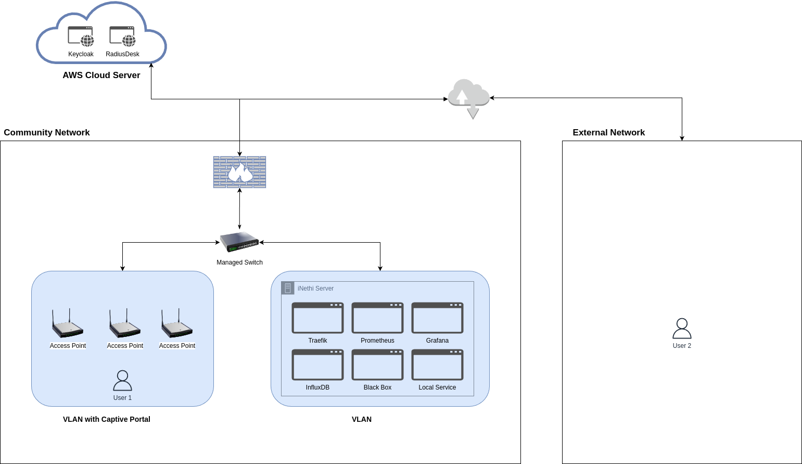
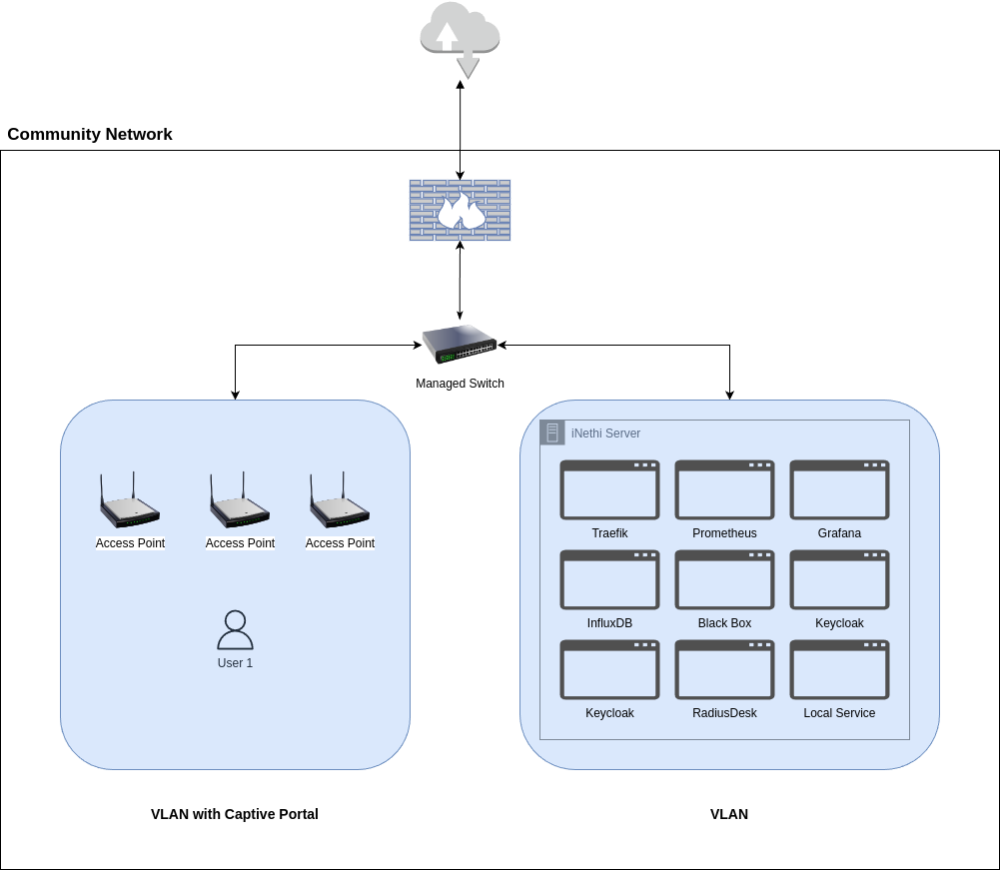

# iNethi Architecture
Explanation of the iNethi system

## Architecture Types
There are two iNethi architectures. Each has advantages and tradeoffs. There is a hybrid architecture (diagram 1) and a 
local architecture (diagram 2).

**Diagram 1**

**Diagram 2**

In the above diagrams the mandatory docker services are detailed for a fully functional iNethi instance. Whether they 
are locally hosted or hosted on a cloud server. When using the iNethi builder the services installed as system 
requirements are:
- [Traefik](https://traefik.io/traefik/)
- [Prometheus](https://prometheus.io/)
- [Grafana](https://grafana.com/)
- [InfluxDB](https://www.influxdata.com/)
- [Blackbox Exporter](https://prometheus.io/docs/guides/multi-target-exporter/)

### Differences in Architecture
The hybrid architecture differs from the local architecture in one key way, [Keycloak](https://www.keycloak.org/) and 
[RadiusDesk](https://github.com/RADIUSdesk) are hosted on a cloud server (AWS in our case). 

Advantages of a hybrid architecture:
- This allows admin users to manage multiple networks from one place. RadiusDesk vouchers for internet access can be 
generated that can be used for access to multiple networks, enabling seamless roaming between networks
- Keycloak accounts can be used for authentication at different networks and for global and local access to iNethi services
using the same username and password creating a single sign on environment (SSO), more on this later.

Disadvantages of a hybrid architecture
- Constant need for an uplink to the internet to validate users SSO status and voucher usage/access. If there is no
access then users will not be able to access any network architecture that utilises Keycloak and RadiusDesk

### Differences to Users
The obvious downside to using a local versus hybrid architecture is the ability for users to have an SSO environment.
Running local instances of keycloak would require them to have different credentials for every iNethi instance they interact with and for the cloud
services.

## the iNethi App
The iNethi app requires a keycloak account for authentication if the user wants to access certain iNethi services. The
app can be used within an iNethi network or outside using an external network connection. This is depicted in Diagram 1
with _User 1_ being able to access the app within an iNethi network and _User 2_ accessing the network externally.

For the purpose of explanation lets call _User 1_ in _Diagram 1_ H1 (hybrid user 1), _User 2_ in _Diagram 1_ H2 
(hybrid user 2) and _User 1_ in _Diagram 2_ L1 (local user 1).

### Functional Differences
- H1: can log in to any iNethi services whether locally hosted or hosted in the cloud using the same password. Can use 
their RadiusDesk vouchers on multiple (networks if applicable).
- H2: can log in to any iNethi services whether locally hosted or hosted in the cloud using the same password. Can use
  their RadiusDesk vouchers on multiple (networks if applicable).
- L1: can only log in to iNethi services within _Diagram 2's_ network with the keycloak credentials they have set up 
using the community network in _Diagram 2_. Can only use their RadiusDesk vouchers for the network depicted in 
_Diagram 2_.