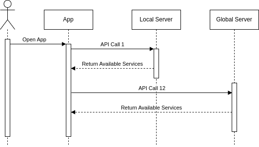

# iNethi App
The iNethi app is a Reactive Native App with the purpose of bringing all iNethi services into one space.

## Populating the Home Page
The home page of the app populates with buttons for various services and divides them into sections based on the
service's characteristics. This is dynamic. The buttons rendered adn the locations they point to depends on whether the
user has an Internet connection, whether the user is connected to an iNethi Community Network and what services are 
available if they are. The user cases are detailed below.

### Connected to an iNethi Network
The user is connected to an iNethi network.

#### Explanation
- _API Call 1_:
- _API Call 2_:

### Not Connected to an iNethi Network